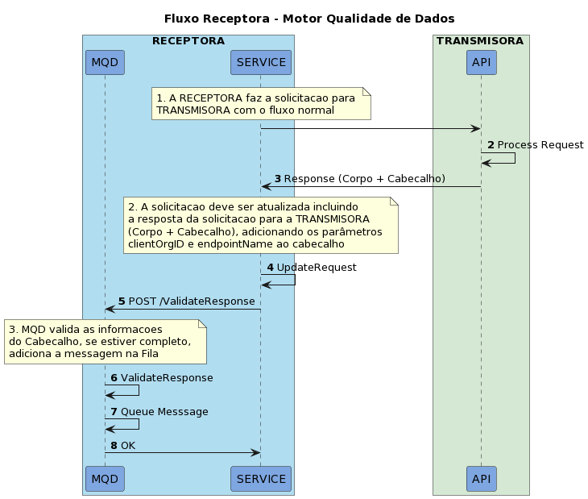

# Fluxo RECEPTORA

Este fluxo representa o processo de enfileramento de messagens e integração com o MQD na visão da RECEPTORA



## Passos

| Passos | Participante | Descrição |
|-|-|-|
| 1. | SERVICE | O serviço gera uma solicitação para a API da TRANSMISORA |
| 2. | API | A API processa a solicitação recebida |
| 3. | API | A API retorna um resultado para a solicitação |
| 4. | SERVICE | O Serviço gera uma nova requisição, tendo como base a Resposta da TRANSMISORA, incluindo no cabeçalho o valor de [EndpointName] e [serverOrgId] que indica o ID do transmissor |
| 5. | SERVICE | O serviço envia a nova solicitação para a API do MQD  |
| 6. | MQD | MQD Valida se as informações do cabeçalho estão completas e corretas |
| 7. | MQD | MQD encaminha as informações para serem processadas posteriormente |
| 8. | MQD | MQD responde OK se o processo foi bem-sucedido |

### Exemplo de Soliciação da API - MQD

| endpointName | serverOrgId | x-fapi-interaction-id | Corpo |
|-|-|-|-|
| /loans/v2/contracts/{contractId}/payments <br /> **Nome do endpoint e deve corresponder à lista de [endpoints](../ENDPOINTS.md)  aceitos**  | c73bcdcc-2669-4bf6-81d3-e4ae73fb11fd <br /> **Id da TRANSMISORA** | 241e202-e8f0-5f5a-9651-ebc257371e24 <br /> **valor x-fapi usado durante a transação**  | Valor retornado como resposta da TRANSMISORA |


```console
curl --location 'http://localhost:8080/ValidateResponse' \
--header 'serverOrgId: c73bcdcc-2669-4bf6-81d3-e4ae73fb11fd' \
--header 'endpointName: /loans/v2/contracts/{contractId}/payments' \
--header 'x-fapi-interaction-id: 241e202-e8f0-5f5a-9651-ebc257371e24' \
--header 'Content-Type: text/plain' \
--data '{
  "data": {
    "paidInstalments": 73,
    "contractOutstandingBalance": "1000.0400",
    "releases": [
      {
        "paymentId": "XlthLXpBLVowLTldW2EtekEtWjAtOVwtXXswLDk5fSQ",
        "isOverParcelPayment": true,
        "instalmentId": "WGx0aExYcEJMVm93TFRsZFcyRXRla0V0V2pBdE9Wd3RYWH",
        "paidDate": "2021-05-21",
        "currency": "BRL",
        "paidAmount": "1000.0400",
        "overParcel": {
          "fees": [
            {
              "feeName": "Reavaliação periódica do bem",
              "feeCode": "aval_bem",
              "feeAmount": "100000.0400"
            }
          ],
          "charges": [
            {
              "chargeType": "JUROS_REMUNERATORIOS_POR_ATRASO",
              "chargeAdditionalInfo": "Informações adicionais",
              "chargeAmount": "1000.0400"
            }
          ]
        }
      }
    ]
  },
  "links": {
    "self": "https://api.banco.com.br/open-banking/api/v1/resource",
    "first": "https://api.banco.com.br/open-banking/api/v1/resource",
    "prev": "https://api.banco.com.br/open-banking/api/v1/resource",
    "next": "https://api.banco.com.br/open-banking/api/v1/resource",
    "last": "https://api.banco.com.br/open-banking/api/v1/resource"
  },
  "meta": {
    "totalRecords": 1,
    "totalPages": 1,
    "requestDateTime": "2021-05-21T08:30:00Z"
  }
}'
```