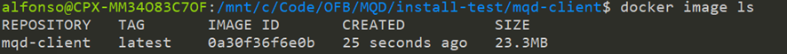

# Manual de Instalação

O presente documento fornece orientações para instalação do Motor de Qualidade de Dados nas Instituições Financeiras participantes do Open Finance Brasil.


1. [Instalação](#instalação)
2. [Configuração](#configuração)

----------

## Instalação

O primeiro passo é clonar o código do repositório (disponível no Github) para a sua pasta local.

```console
git clone https://github.com/OpenBanking-Brasil/mqd-client.git
```


Em seguida, valide se o clone foi realizado corretamente em sua pasta local.

```console
ls -la
```


Acesse a pasta do código criada localmente.

```console
cd mqd-client/
```


Após acessar a pasta, é necessário compilar e criar a imagem que será utilizada pelo Docker para o container onde o Motor de Qualidade de Dados estará alocado.

```console
docker build --no-cache -f infra/dockerfile/dockerfile-minimal -t mqd-client .
```


A seguir, valide se a imagem foi criada corretamente.
```console
docker image ls
```


Modifique as variáveis ​​de ambiente de acordo com as necessidades no arquivo:

```cmd
/infra/dockerfile/docker-compose.yaml
```


```json
version: '3'
services:
  mqd-client:
    image: mqd-client:latest
    ports:
      - "8080:8080"
    environment:
      - API_PORT=:8080
      - SERVER_ORG_ID=09b20d09-bf30-4497-938e-b0ead8ce9629
      #- REPORT_EXECUTION_WINDOW=30 
      #- REPORT_EXECUTION_NUMBER= 200000 
      - ENVIRONMENT=DEV
      - LOGGING_LEVEL=WARNING
      - APPLICATION_MODE=TRANSMITTER
      - PROXY_URL=http://127.0.0.1:8082
    network_mode: "host"
    depends_on:
      - proxy
    restart: always
    deploy:
      resources:
        limits:
          cpus: '1'
          memory: 1024M
        reservations:
          cpus: '0.25'
          memory: 128M
  proxy:
    image: nginx
    ports:
      - "8082:80"
    volumes:
     - ./proxy/default.sandbox.conf:/etc/nginx/conf.d/default.conf:ro
     - ./certificates:/etc/ssl  

```

### Variables de ambiente

| Nome | Descrição | Valores | 
|-|-|-|
|API_PORT|Porta que será usada para expor os endpoints da API|":" + porta|
|SERVER_ORG_ID|ID da organização da instituição financeira| Organisation Id Valido |
|REPORT_EXECUTION_WINDOW|Indica a janela de execução para envio de relatórios, <br /> **é um campo opcional, caso não esteja definido seu valor será carregado automaticamente**|> 0, < 60|
|REPORT_EXECUTION_NUMBER| Indica a quantidade de relatórios que devem ser processados ​​antes do envio, caso a quantidade de relatórios atinja o limite, o relatório é enviado automaticamente e o timer da janela de tempo é reiniciado <br /> **é um campo opcional, caso não esteja definido seu valor será carregado automaticamente** |>0, < 2000000|
|ENVIRONMENT|Indica o ambiente em que o aplicativo está sendo instalado|PROD <br /> SANDBOX <br /> DEV |
|LOGGING_LEVEL|Indica o nível de rastreio que será utilizado na aplicação|DEBUG <br /> INFO <br /> WARNING <br /> ERROR <br /> FATAL  |
|APPLICATION_MODE|Indica a forma como será executada a aplicação, isso dependerá se se trata de uma instituição do tipo transmissora ou receptora.|TRANSMITTER <br /> RECEIVER |
|PROXY_URL|Indica a url onde será encontrado o Proxy que estabelece conexão segura com o servidor.|URL valida|

### Volumes

| Volume | Descrição |
|-|-|
| /etc/nginx/conf.d/default.conf | Volume do arquivo de configuração NGINX deve ser modificado para utilizar a configuração necessária de acordo com o ambiente onde será instalado <br /> ./proxy/default.prd.conf <br /> ./proxy/default.sandbox.conf <br /> ./proxy/default.dev.conf |
| /etc/ssl | Volumen quie indica la carpeta que contiene los archivos de certificados de acuerdo al archivo de configuracion <br /> /etc/ssl/client.crt <br /> /etc/ssl/client.crt <br /> **Caso os nomes sejam diferentes do configurado, esses nomes podem ser modificados no arquivo/caminho específico**|


Por fim, use o Docker Compose para iniciar a aplicação do Motor de Qualidade de Dados.

```console
docker compose -f infra/dockerfile/docker-compose.yaml up
```


Em seguida, execute o comando para enviar um request de teste a API do Motor de Qualidade de Dados.

```console
curl --location --request GET 'http://localhost:8081/ValidateResponse' \
--header 'serverOrgId: c73bcdcc-2669-4bf6-81d3-e4ae73fb11fd' \
--header 'endpointName: /accounts/v2/accounts' \
--header 'Content-Type: text/plain'
```


## Configuração

Para integrar a validação de dados ao Motor de Qualidade de Dados, é necessário atualizar os serviços que deseja validar conforme fluxo mostrado abaixo.


Para isso é necessário consumir a API conforme especificação

É necessário incluir as informações do cabeçalho nesta nova solicitação: 

| Variable | Descrição | Exemplo |
|--|--|--|
|serverOrgId| Identificador da TRANSMISSORA onde a informação foi solicitada | c73bcdcc-2669-4bf6-81d3-e4ae73fb11fd |
| endpointName | Nome do endpoint que foi solicitado | /contas/v2/contas |

